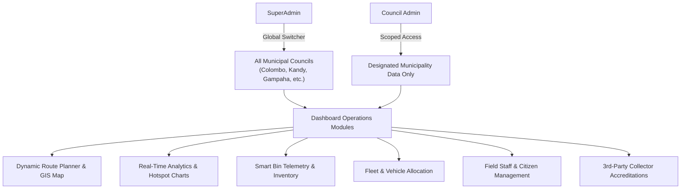
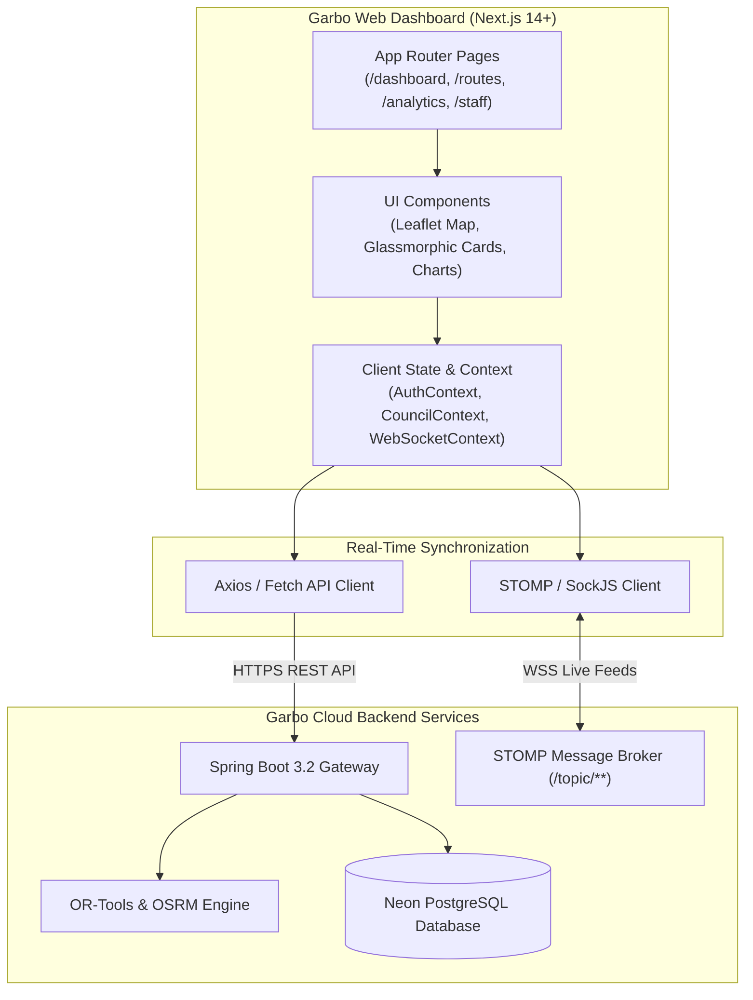
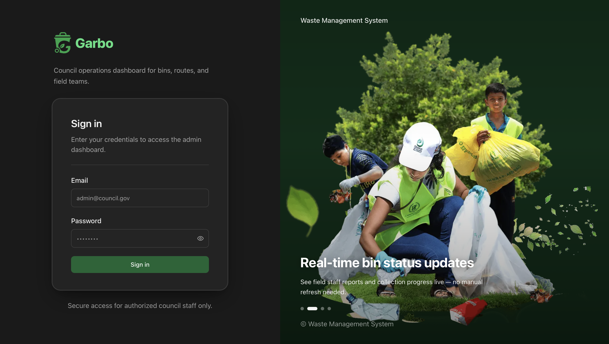
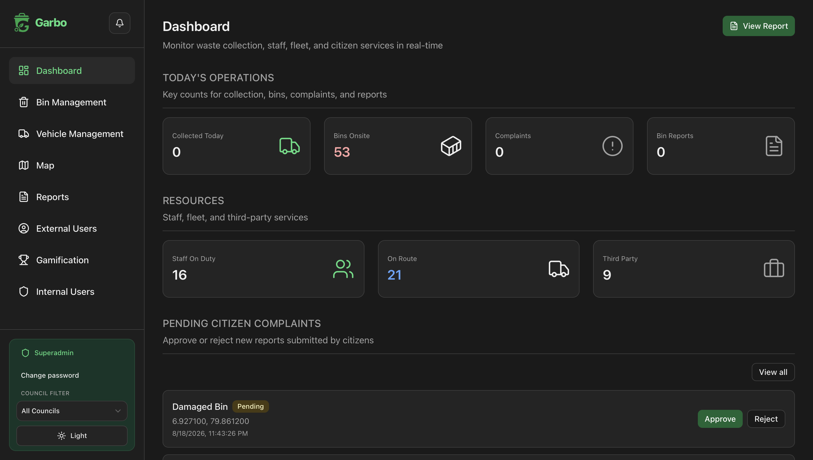
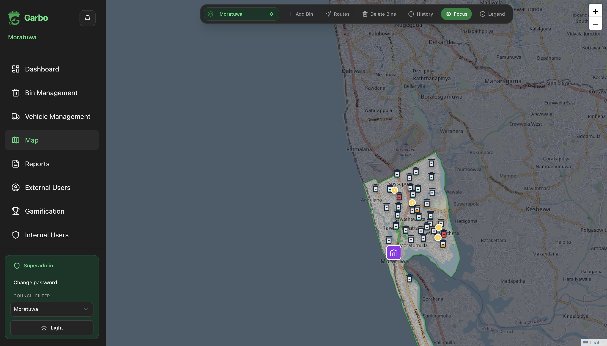

# Garbo Web Dashboard (`Garbo_web_dashboard`)

[](https://nextjs.org/)
[](https://react.dev/)
[](https://www.typescriptlang.org/)
[](https://tailwindcss.com/)
[](https://leafletjs.com/)
[](https://stomp-js.github.io/)
[](https://www.docker.com/)

> **Garbo Web Dashboard** is a high-performance, real-time command center built with **Next.js**, **React**, and **TypeScript**. It provides municipal authorities, council administrators, and super-administrators with comprehensive spatial telemetry, automated route planning, fleet tracking, and staff management capabilities.

---

## Table of Contents
- [1. Overview & Operational Value](#1-overview--operational-value)
- [2. Multi-Tenant Council Governance](#2-multi-tenant-council-governance)
- [3. System Architecture & GIS Data Flow](#3-system-architecture--gis-data-flow)
- [4. User Interface Showcase](#4-user-interface-showcase)
  - [Authentication & Council Selection](#authentication--council-selection)
  - [Interactive GIS Map & Automated Route Planner](#interactive-gis-map--automated-route-planner)
  - [Municipal Analytics & Overflow Hotspots](#municipal-analytics--overflow-hotspots)
  - [Council Staff & Fleet Management](#council-staff--fleet-management)
  - [3rd-Party Collector Verification](#3rd-party-collector-verification)
- [5. Technology Stack](#5-technology-stack)
- [6. Project Structure](#6-project-structure)
- [7. Getting Started & Local Setup](#7-getting-started--local-setup)
- [8. Docker & Production Deployment](#8-docker--production-deployment)

---

## 1. Overview & Operational Value

The **Garbo Web Dashboard** transforms municipal waste operations from reactive complaint handling into proactive, data-driven resource recovery:

* **Automated Route Dispatch**: Visualize dynamic collection routes generated by Google OR-Tools and OSRM, inspect turn-by-turn bin sequences, and dispatch assignments directly to driver mobile devices.
* **Spatial Telemetry & Bin Health**: Live GIS map rendering of all municipal bins with color-coded fill percentages, damage indicators, and discrepancy alerts.
* **Workforce & Fleet Management**: Monitor real-time driver GPS locations, active route session statuses, duty toggles, and collector performance metrics.
* **Civic Governance & Audit Trails**: Review citizen complaints with high-resolution photo evidence, audit staff actions, and manage 3rd-party recycler accreditations.

---

## 2. Multi-Tenant Council Governance

The dashboard implements role-based access control (RBAC) with strict multi-council data scoping:



---

## 3. System Architecture & GIS Data Flow



---

## 4. User Interface Showcase

| Administrative Login | Main Operations Dashboard | Interactive GIS Map & Route Planner |
|:---:|:---:|:---:|
|  |  |  |
| *Role-aware administrative sign-in* | *Live municipal telemetry & KPI summary* | *Color-coded smart bin map & route dispatch* |

---

## 5. Technology Stack

| Layer / Category | Technology | Description |
|---|---|---|
| **Framework** | Next.js `14.x` / `15.x` | React production framework (App Router) |
| **Language** | TypeScript `5.x` | Strongly typed JavaScript |
| **Styling & Design** | Tailwind CSS `3.4+` | Modern responsive utility-first CSS |
| **GIS & Interactive Maps** | Leaflet / React-Leaflet / MapLibre | Real-time map rendering and polyline route visualizer |
| **Charts & Data Viz** | Chart.js / Recharts | Operational metrics and time-series analytics |
| **Real-Time Data** | `@stomp/stompjs` & SockJS | Live telemetry pub/sub client |
| **HTTP Client** | Axios / Fetch API | REST API communication with Bearer auth interceptors |
| **Error Monitoring** | Sentry SDK | Frontend error tracking and telemetry |
| **Containerization** | Docker | Multi-stage Node Alpine container build |

---

## 6. Project Structure

```text
Garbo_web_dashboard/
├── .github/
│   └── workflows/
│       ├── ci.yml                    # Automated build validation and test suite
│       └── cd.yml                    # AWS EC2 container deployment via ECR & SSM
├── docs/
│   └── screenshots/                  # Showcase screenshots for documentation
├── src/
│   ├── app/                          # Next.js App Router structure
│   │   ├── (auth)/                   # Authentication pages (login, password reset)
│   │   ├── dashboard/                # Main dashboard overview
│   │   ├── routes/                   # Route planner & live GIS map
│   │   ├── bins/                     # Smart bin inventory & suggestions
│   │   ├── staff/                    # Internal staff & fleet management
│   │   ├── users/                    # Citizens & external collectors
│   │   ├── analytics/                # Municipal reporting & charts
│   │   └── layout.tsx                # Root layout with providers & navigation
│   ├── components/                   # Reusable React UI components
│   │   ├── map/                      # Leaflet map widgets and markers
│   │   ├── ui/                       # Buttons, modals, tables, and inputs
│   │   └── analytics/                # Metric cards and chart components
│   ├── context/                      # React Context providers (Auth, Council, STOMP)
│   ├── lib/                          # Utility functions, API clients, and helpers
│   ├── services/                     # Backend REST API service wrappers
│   └── types/                        # TypeScript type definitions and interfaces
├── public/                           # Static assets, icons, and logos
├── Dockerfile                        # Multi-stage optimized production Docker build
├── package.json                      # Dependencies and npm scripts
├── tailwind.config.ts                # Tailwind design tokens and themes
├── tsconfig.json                     # TypeScript compiler configuration
└── README.md                         # Project documentation
```

---

## 7. Getting Started & Local Setup

### Prerequisites
* **Node.js**: `18.x` or `20.x` LTS
* **npm** or **pnpm**
* Running instance of [Garbo Backend](https://github.com/CodeMIndsUoM/Garbo_backend)

### 1. Clone & Install Dependencies
```bash
git clone https://github.com/CodeMIndsUoM/Garbo_web_dashboard.git
cd Garbo_web_dashboard
npm install
```

### 2. Configure Environment Variables
Create `.env.local` from `.env.example`:
```bash
cp .env.example .env.local
```

Edit `.env.local`:
```env
# Backend API Base URL
NEXT_PUBLIC_API_BASE_URL=http://localhost:8081

# WebSocket STOMP URL
NEXT_PUBLIC_WS_URL=ws://localhost:8081/ws-stomp

# Sentry Telemetry (optional)
NEXT_PUBLIC_SENTRY_DSN=
```

### 3. Run Development Server
```bash
npm run dev
```
Open [http://localhost:3000](http://localhost:3000) in your browser.

---

## 8. Docker & Production Deployment

### Build and Run with Docker
```bash
# Build production image
docker build -t garbo-web-dashboard:latest .

# Run container
docker run -p 3000:3000 --env-file .env.local garbo-web-dashboard:latest
```

### Continuous Deployment Pipeline
On push to `main` or `devops/platform`, GitHub Actions builds and pushes the image to **AWS ECR** and automatically deploys to **AWS EC2** using **AWS SSM Run Command**.

---

## Contributors & Maintainers
Developed by the **CodeMinds UoM** Engineering Team.
